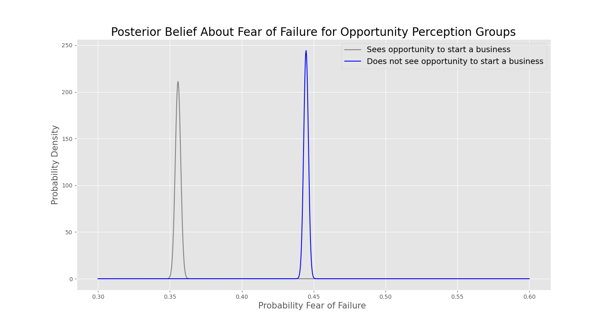

# Does seeing opportunities decrease the likelihood of fearing failure?

# Background
Creativity and seeing potential in the world around you is a phenomena shared by people in every part of the world. While some may be motivated by the economics, others may also be moitvated to create to imporove each other's lives. Wanting to make a positive contribution is a beautiful part of what makes us human. At the same time, fear and, in many cultures fearing failure inparticular, is another core aspect of the human experience. 

As someone who is passionate about creating things and experiences that help people, I was curious about the relationship between fear of failure and perception of opportunity to start a business. Would the prevalence of fear of failure be greater among those who did not see an opportunity around them? How does perception of opportunity relate to the prevalence of fear of failure? What other factors globally or within specific countries contribute to the prevalance of citing fear of failure as the reason for not starting a business? Let's explore the data, shall we.

# Data

The Global Entreprenuership Monitor (GEM) is a London-based non-profit that collects data directly from individual entrepreneurs. GEM's theory of change rests on the assumption that entreprenuership is a core mechanism for economic development and for meeting social needs, like the United Nations Sustainable Development goals (SDGs). The organization conducts an annual survey to collect data on the attitudes and behaviors of people in 115+ countries on topics related to entreprenuership. In each country, reseachers interview 2000 people using a questionnaire and prescribed methodology. I'll be focusing on the 2016 global individual-level dataset, because it is the most recent dataset available. 

For this project, I'm exploring how people's perception of business opportunity in their communities relates to their citing fear of failure. Does seeing opportunity make it more of less likely someone will site fear as the reason they are not starting a business? Or is fear of failure present more often for people who don't see opportunity? 

# Data Cleaning

Initially, I had been intersted in focusing on exploring my topics for India. However, there was not data for my data fields of interest, so I switched to a global focus instead.

To clearn the global data, after indexing out my columns of interest, I removed rows containing NaN using the <code>Pandas</code> method <code>df.dropna()</code>. 

This reduced the number of rows from 194,824 to 126,608, each representing the response of a study participant. Though a large proportion of the dataset, the remaining data was still large enough for my global analysis. 

 

# Data Collection Methods

## Perception of Opportunity

* If an individual sees opportunities to start a firm in the area where they live

 

## Researchers asked:
 

>"In the next six months, will there be good opportunities for starting a business in the area where you live? "

 

## Fear of Failure  

* If fear of failure would prevent an individual from setting up a business

 

## Researchers asked:
 

>"Would fear of failure prevent you from starting a business?"

 

To understand if there is a statistically significant relationship between fear of failure and perception of opportunity, I began analysis with the Fisher's Exact test. 

 

# Analysis: Fear of Failure & Perception of Opportunity

My curiousity led me to the alternative hypothesis that the proportion of individuals who cite fear of failure is higher among inviduals who do not perceive opportunity. My Null is, therefore, that there is no statistical significance or relationship between fear of failure and those who perceieve opportunity.

To test my Null hypothesis against the data, I began by running a Fisher's exact test.

## Fisher's Exact Test

I chose Fisher's Exact test because it measures the significance of the association between two kinds of classification (in this case respondents citing fear of failure and perception of oppportunity to start a business).

I used a contingency table for the Fisher's Exact test, which shows the proportion of 126,608 respondents' answers over four response combinations. 

 

<table>
  <thead>
    <tr>
      <th></th>
      <th></th>
      <th></th>
      <th></th>
    </tr>
    <tr>
      <th>Response</th>
      <th>Perception of Opportunity</th>
      <th>Fear of Failure</th>
      <th>Row total</th>
    </tr>
  </thead>
  <tbody>
    <tr>
    <td>No</td>
      <td>40,614</td>
      <td>32,725</td>
      <td>73,339</td>
    </tr>
    <tr>
      <td>Yes</td>
      <td>34,400</td>
      <td>18,869</td>
      <td>53,269</td>
    </tr>
    <tr>
      <td>Column total</td>
      <td>75,014</td>
      <td>51,594</td>
      <td>N = 126,608</td>
    </tr>
  </tbody>
</table>

 

### Fisher's exact test between fear of failure and perception of opportunity globally showed 
 

## Bayes AB Test

### Education Levels (shown in x-axis above)
0. Pre-primary Education
1. Primary Education Or First Stage Of Basic Education
2. Lower  Secondary Or Second Stage Of Basic Education
3. (Upper) Secondary Education
4. Post-secondary Non-tertiary Education
5. First Stage Of Tertiary Education
6. Second Stage Of Tertiary Education

## Future Directions

* What influences someone's ability to see business opportunities in their communities? 

