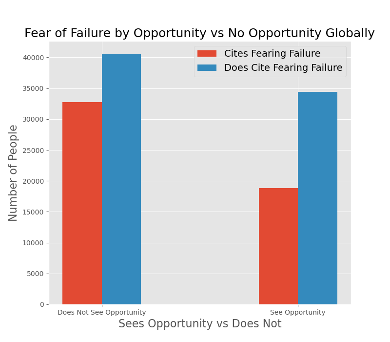

# Does seeing opportunities decrease the likelihood of fearing failure?

# Data Description

The Global Entreprenuership Monitor (GEM) is a London-based non-profit that conducts an annual survey to collect data on the attitudes and behaviors of people in 200+ countries on entreprenuership. In each country, reseachers ask 2000 people fill out a questionnaire. This project is focusing on the 2016 global individual-level dataset, because it is the most recent dataset made available to the public. 

For this project, I'm exploring how people's perception of business opportunity in their communities relates to fear of failure. Does seeing opportunity make it more of less likely someone will site fear as the reason they are not starting a business? Or is fear of failure present more often for people who don't see opportunity? 

## Defintions for terms of analysis

### Perception of Opportunity 
* If an individual sees opportunities to start a firm in the area where they live

### Fear of Failure  
* If fear of failure would prevent an individual from setting up a business

> 
>"Would fear of failure prevent you from starting a business?"
>

## Fisher's Exact Test

### Fiser's exact test between fear of failure and perpection of opportunity globally showed 

### Education Levels (shown in x-axis above)
0. Pre-primary Education
1. Primary Education Or First Stage Of Basic Education
2. Lower  Secondary Or Second Stage Of Basic Education
3. (Upper) Secondary Education
4. Post-secondary Non-tertiary Education
5. First Stage Of Tertiary Education
6. Second Stage Of Tertiary Education

